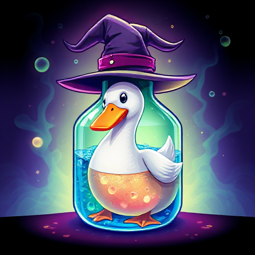

# 

# 🧪 Chemical Goose Reaction 🦢

Embark on an adventurous journey where chemistry meets mystery! Solve puzzles, uncover clues, and trigger **chemical reactions** based on the periodic table in this educational and engaging Godot game. 

## 🕹️ Gameplay

*   Explore interactive environments.
*   Decipher clues hidden within the game world.
*   Experiment with chemical reactions to unlock new areas and solve puzzles.
*   Learn about the periodic table in a fun and interactive way!

## ✨ Features

*   Unique blend of adventure and education.
*   Engaging puzzles based on real-world chemistry.
*   Charming visuals and immersive sound design.
*   A fun way to learn about the periodic table!

## 🛠️ Technologies

*   Godot Engine

## 🚀 How to Play

1.  Download the game from [Link to Release/Download].
2.  Extract the files.
3.  Run the executable.
4.  Start your chemical adventure!
